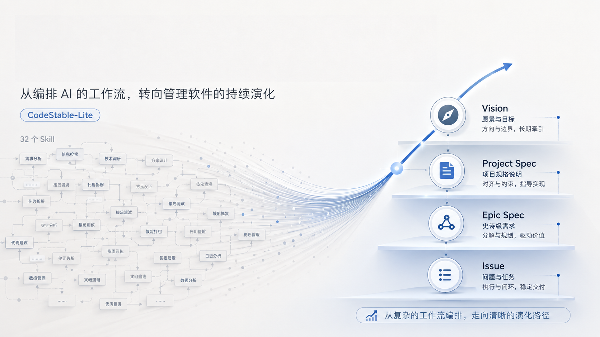

<div align="center">

# CodeStable



**English** · [中文](./README.md)

**Help people and agents manage software uncertainty and state evolution together.**

<p>
  
  
  
</p>

</div>

---

CodeStable is a **controlled software-evolution framework** for AI-assisted development. It does not make people choose Talk, Design, or Do for an agent, and it does not force every request to produce a complete Vision, Spec, Epic, or Issue set. Instead, it helps people and agents continually judge:

- what the project knows now and what it is trying to become;
- how much management this change deserves;
- whether the missing piece is requirement convergence, current-state understanding, or feasibility evidence;
- when a new fact means continue, write back, or explicitly change course; and
- which conclusions are stable enough to become context for the next round of work.

Those judgments and their evidence live in a project-readable `codestable/` workspace, so a long-lived project does not depend on the memory of one conversation or one agent.

## Install

Install the maintained modified version with the Skills CLI:

Repository: [`joseph-bing-han/CodeStable-Lite`](https://github.com/joseph-bing-han/CodeStable-Lite)

```bash
npx skills add joseph-bing-han/CodeStable-Lite
```

Installation is project-local by default. Add `-g` to make this modified version available across projects:

```bash
npx skills add joseph-bing-han/CodeStable-Lite -g
```

For local development, verify discovery from the repository root:

```bash
npx skills add . --list
```

Update the installed single Skill:

```bash
npx skills update cs
```

Onboard a project through the single entry:

```bash
/cs onboard CodeStable in this project
```

Use that same entry afterwards:

```bash
/cs
```

You can say “let's clarify this change,” “how does this path work?”, “make a quick fix,” “design the implementation,” “work on this issue,” or “close and capture the result.” `cs` selects the understanding and action that the present intent needs; you do not have to memorize a catalog of commands.

The repository distributes one Skill at `skills/cs/`. Shared contracts live in `SKILL.md`; scenario-specific rules load progressively from `references/`; templates and initialization scripts stay in the same package. The released version lives in `VERSION`, with release notes in `CHANGELOG.md`.

## It solves more than “how can agents take more steps?”

An AI that can write code does not automatically know a long-lived project's current boundaries, historical trade-offs, or the real home of a change. Typical failures are not just missing plans:

- a question that has not formed is disguised as a detailed task;
- an agent loads too much irrelevant context or misses the constraint that matters;
- code, specifications, and design history exist separately, but no one knows which conclusion still governs the present;
- implementation disproves its design but continues along the old plan; or
- completed work never returns its useful learning to where the next round will read it.

CodeStable centers the software's state, understanding, and changes—not agent orchestration. It can work with any agent, model, or collaboration style; its job is to make the project those executors face understandable and able to evolve.

## A system of judgment, not a fixed pipeline

### Identify Question / Issue, then choose a posture and load only needed context

Within one conversation, a user may be asking a Question or discussing, understanding current behavior, designing, making a quick change, advancing managed work, or closing it out. `cs` first distinguishes a Question from an Issue; only an Issue receives a primary posture and the smallest set of rules and project material for that posture. Material already read and unchanged is reused instead of being pushed into context again.

Users therefore do not need to choose a sub-skill, and the system does not load workflows that have not happened. For an agent, the right context matters more than a larger context.

### Give Issues the same traceable Task spine; Questions create no Task

First distinguish a Question from an Issue. Explanations, facts, definitions, simple current-state answers, usage guidance, and option comparisons that can end with the answer are answered directly without creating a Task. Requests to investigate and deliver, design and write back, modify code or documentation, fix behavior, verify results, synchronize `codestable/`, or advance or close an existing entity enter the Task spine as Issues:

```text
create or resume Task
  -> execute one observable batch
  -> update Task
  -> continue implementation, verification, and required fixes
  -> mark completed
  -> archive atomically and verify no matching active Task remains
```

If the distinction is unclear, use AskQuestion before creating a Task and let the user choose; never promote a Question merely because it uses `/cs`, includes a code path, or names a technology. The Task List is the source of truth; an agent's native Todo or Tasks view is only a runtime mirror. For a confirmed Issue, “No Issue,” “no ff,” “read-only,” and “small change” may reduce business artifacts, but they never bypass Task creation, updates, completion, and archive. `completed` is only a pre-archive state. Closure requires a valid document under `codestable/tasks/archived/`, no matching active document, and a conflict-free scan.

Archived filenames use `YYYY-MM-DD-NNN-{task}.md`. `NNN` is a three-digit sequence shared by every Task archived on that date; it resets to `001` each day and increases in actual archive order.

For existing `YYYY-MM-DD-{task}.md` archives, run `python3 <cs-skill>/scripts/codestable_task_runtime.py --root . migrate-archive-filenames`. A date with one legacy archive can be migrated automatically; multiple legacy archives on one date require manually assigning the known completion order.

The Lite runtime permits only `tasks/active/` and `tasks/archived/`. Create and archive use exclusive publication that never overwrites existing evidence; scan treats extra directories, noncanonical files, and symlinks as failures. Archive records its source snapshot hash, so the original command can be replayed safely if a success response is lost. If an active path is recreated after archive, archive or cleanup removes it only when its content matches either the unique valid archive or that archive's recorded source snapshot; divergent duplicates stay fail-closed.

Before plan commitment, structured questions may clarify the goal, boundary, acceptance, and authorization. Once the plan is written to the Task, execution becomes unattended: the agent does not ask about ordinary progress, and asks only when an unverified gap would change the goal, correctness, or authority. It chooses the recommended direction by contract consistency, risk, reversibility, evidence strength, and total cost, resolves failures, performs the retention check, and continues until the plan, verification gates, and Task archive are complete. User corrections supersede affected prior direction; host capabilities must be checked from actual tool schemas, not inferred from a model name.

### Locate change in a four-layer world model

```text
Vision Spec ──extract target slice──> Epic Spec ──advance──> Issues (including ff quick-change records)
     │                                │                           │
     │                                └──close and graduate───────┤
     └──target world                         Project Spec (current stable understanding)
```

| Layer | Question it answers | What belongs there |
|---|---|---|
| Vision | What kind of world should the application become? | User journeys, capability maps, candidate and mutually exclusive directions |
| Project Spec | Which understandings and boundaries currently hold? | Current capabilities, long-lived constraints, shared language, architectural trade-offs |
| Epic Spec | How is this bounded larger change progressing? | Living specification, current advance, blockers, graduation candidates |
| Issue | What must this closeable evolution accomplish? | Goal, evidence, design, implementation, verification, and write-back |
| Task | How does this run advance and recover? | Plan, batch progress, evidence index, completion, and atomic archive |

The Project Spec is the **authoritative entry point** for current stable understanding, not unquestionable absolute truth. A user's newest confirmation takes precedence, and code or other evidence can show that a record is stale. On conflict, investigate and correct, preserve history, or explicitly change course—never silently let one overwrite the other.

### Use different techniques for different unknowns

Unknowns are normal. They should not be hidden by splitting work into tasks too early.

| What is unknown | First technique | Stop when |
|---|---|---|
| The real problem, boundary, or trade-off | Talk | The problem, boundary, and largest unknown can be stated clearly |
| How the current system reaches a result from a trigger | Current-state explanation / Explore | A causal model is sufficient for action and remaining unknowns are explicit |
| Whether a future design can work | Spike | The highest-risk path has real evidence; if it fails, address the design first |

Design does not write unread areas as settled conclusions. Do writes back small deviations; when a goal, boundary, or key design view no longer holds, it returns to Design, records the new course in the Task, and continues. **A change of course must be explicit and traceable.**

### Match management strength to the change

| Situation | Default response |
|---|---|
| Small, clear, one-session, or explicitly urgent | Implement and verify directly; leave a compact `ff` quick-change record by default |
| Scope trade-offs, multiple rounds, handoff, or material risk | Ordinary Issue |
| Cross-module or multi-batch change with an evolving bounded specification | Epic Spec; clear slices may advance directly inside it or use Issues when useful |
| Complex current path, conflicting evidence, or understanding worth reusing | Explore Issue |

Management is not ceremony. A user can explicitly omit an `ff` business record; a user can also request an Issue for work that looks small. For a confirmed Issue, the Task runtime ledger remains mandatory. After verified implementation, stable facts from an independent Issue are synchronized to the Project Spec, Epic work is synchronized to the Epic Spec, and reusable Talk, Note, and Tool outputs are checked; this does not change business status. Issue/Epic closure and Epic graduation still require the relevant authorization; otherwise they remain open. Task archive is the mechanical closure of every Issue workflow, not the closing of an Issue or Epic or a move to `done/`.

### Graduate reusable understanding to the right layer

An Issue is not merely a to-do. It is a reviewable software-evolution transaction with a defined cognitive starting point, limited attention boundary, and end condition. It keeps investigation, design, implementation, and verification inside one change boundary.

During implementation and close, process, failed attempts, and evidence remain with the Issue or Epic. Verified stable facts synchronize by ownership; an Epic graduates its stable conclusions to the Project Spec only after the user authorizes Epic closure:

```text
Independent Issue   → Project Spec
Issue inside Epic   → Its Epic Spec
Explore Issue      → Stable current-state explanation in Project Spec
Closed Epic        → Project Spec, then check realization state in Vision
```

Talk captures a converged discussion, Note captures reusable cross-item knowledge, and Tool captures automation that has run successfully, is stable and repeatable, and preserves required authorization. Each related work item checks these exits and records why an artifact is not applicable or is not yet verified. The next round therefore reads usable current understanding rather than guessing what remains valid from old history.

## How quality stays coherent

CodeStable uses the nine product-quality characteristics of [ISO/IEC 25010:2023](https://www.iso.org/standard/78176.html) as a shared vocabulary, not as a certification checklist. Only objectives that change design or acceptance are selected; once selected, Design must address them, Do must provide proportionate evidence, and Close can confirm them only on that evidence.

## How implementation stays economical

Implementation follows a **minimum sufficient change**: understand the real trigger-to-result path, prefer reuse at the correct responsibility boundary or removing and narrowing unnecessary work, and add new code last. A small diff placed beside the symptom is not economical if it belongs elsewhere.

## How UI specs use visuals

When spatial relationships, information hierarchy, or multi-state interaction change what a UI requirement means, Vision or the relevant Spec uses versionable ASCII wireframes, Mermaid, or another suitable diagram. Screenshots and high-fidelity designs can be evidence; they cannot be the only specification.

## The `codestable/` workspace

After onboarding, the project root contains the following workspace. It is the institutional memory that people and agents search and maintain together:

```text
your-project/
└── codestable/
    ├── talks/                  # Confirmed discussion synthesis
    │   └── {NNN}-{name}.md
    ├── vision/                 # Target application world
    │   └── index.md
    ├── spec/                   # Current stable understanding
    │   └── index.md
    ├── epics/                  # Bounded larger changes
    │   └── {NNN}-o|x-{name}/
    │       └── spec.md
    ├── issues/                 # Closeable work, ff, and Explore
    │   ├── {NNN}-o|x-{name}.md
    │   ├── {NNN}-o|x-ff-{name}.md
    │   └── {NNN}-o|x-{name}/   # Explore: index.md and path articles
    ├── notes/                  # Reusable knowledge
    │   └── {NNN}-{name}.md
    ├── tools/                  # Stable tools for proven workflows
    └── tasks/                  # Runtime ledger for confirmed Issues
        ├── active/{task}.md
        └── archived/YYYY-MM-DD-NNN-{task}.md
```

Task and Issue naming are isolated namespaces: `YYYY-MM-DD-NNN-{task}.md` belongs only under `tasks/archived/`. Ordinary Issues and `ff` records are numbered single files placed directly in their owning `issues/` tree. They must not gain date- or Task-named directories or duplicate `fix-note`, `report`, or `analysis` artifacts. Only an Explore Issue uses the `{NNN}-o|x-{name}/index.md` directory form. Legacy noncanonical directories remain searchable evidence, not naming examples for new artifacts.

Lite uses a single-writer Task model and does not create locks, staging, tombstones, or conflicts directories. The runtime uses a SHA-256 stale-snapshot guard, publishes archives atomically without overwriting existing evidence, and leaves long-term history auditing to Git.

- `NNN` increments independently within the issues, epics, notes, and talks trees. Items under `done/` count too.
- Closing changes only `-o-` to `-x-`; the number and name remain unchanged.
- A closed Issue or Epic moves to its `done/` subdirectory only when the user explicitly requests organization; it remains searchable.
- A Talk is written when discussion has converged and is entering action or when the user asks to capture it. Vision target rewrites, Epic closing, and dangerous operations retain explicit human authorization before the actual write or action. Ordinary execution branches do not reopen confirmation after a Task starts; necessary clarification and authorization can still be requested.
- A legacy `.cs/` workspace is never silently copied. After confirming migration, run `python skills/cs/scripts/init_codestable.py --migrate-legacy`; if both `.cs/` and `codestable/` exist, reconcile them manually first.

## People retain control of state transitions

CodeStable does not replace engineering judgment with documents, and it does not treat pre-plan clarification as failure. Agents can search, implement, verify, repair, and write back. People retain control of goals, plan boundaries, closing, publishing, and dangerous operations. After plan commitment, the agent handles ordinary in-scope choices unattended instead of returning mechanical next steps to people.

The aim is not to make AI run more steps automatically. It is to keep software understandable, verifiable, controllable, and evolvable as it encounters new facts.

## Origin

CodeStable grew out of real development on [MA](https://github.com/liuzhengdongfortest/MA). Early vibe coding carried many features. When the same problem recurred and historical trade-offs could not be recalled reliably, the failure was not only model capability: the project lacked a way to preserve current understanding, control change, and capture new learning.

It borrows practices from specifications, design, exploration, and Issues, but does not measure success by producing more artifacts. First judge how much management the change needs; then choose the smallest action and record that are sufficient.

## Roadmap

- [ ] Continue improving Vision shaping and extraction into development slices
- [ ] Continue improving adaptive judgment among direct changes, Issues, Epics, and Explore
- [ ] Use real-project feedback to calibrate documentation, templates, and action rules

Issues and feedback from real development and refactoring work are welcome.

---

## Star History
<div align="center">
MIT License · by [@liuzhengdong](https://github.com/liuzhengdongfortest)
</div>
